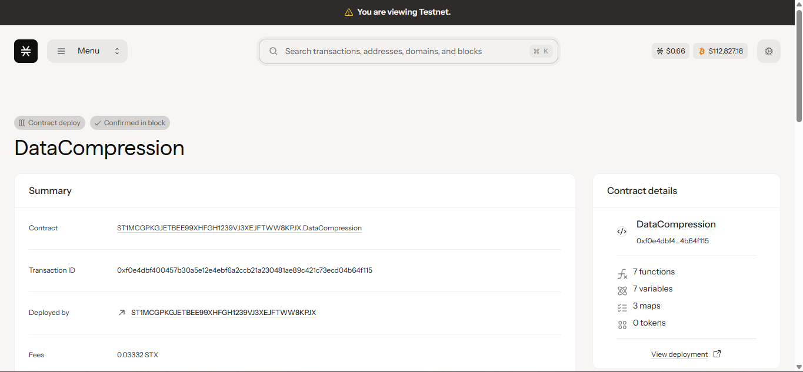

# Data Compression

## Project Description
Build efficient data storage and compression utilities on the Stacks blockchain. This smart contract provides a decentralized solution for storing compressed data with chunking capabilities, metadata management, and secure access controls. Users can store large datasets efficiently while maintaining data integrity through cryptographic hashing.

## Project Vision
To create a decentralized data storage infrastructure that maximizes efficiency through intelligent compression and chunking mechanisms. Our vision is to build the foundation for Web3 data management, enabling applications to store and retrieve large amounts of data cost-effectively while maintaining security, immutability, and accessibility on the blockchain.

## Future Scope
- **Advanced Compression Algorithms**: Implement multiple compression standards (LZ4, DEFLATE, Brotli)
- **Dynamic Compression Selection**: Auto-select optimal compression based on data type and size
- **Data Deduplication**: Identify and eliminate duplicate data across the network
- **Distributed Storage Network**: Connect multiple nodes for redundant data storage
- **Data Marketplace**: Enable users to monetize their stored data and storage capacity
- **Cross-chain Compatibility**: Support data storage across multiple blockchain networks
- **Machine Learning Integration**: AI-powered compression optimization and data analysis
- **Real-time Streaming**: Support for streaming data compression and live data feeds
- **Enterprise APIs**: Professional-grade APIs for business integration
- **Mobile SDK**: Native mobile libraries for seamless app integration
- **Data Analytics Dashboard**: Comprehensive metrics and usage analytics
- **Encryption Layer**: End-to-end encryption for sensitive data storage

## Contract Address Details
*Contract deployment information will be added here*
- **Testnet**: `[To be provided]`
- **Mainnet**: `[To be provided]`
- **Contract Name**: `data-compression`
- **Version**: `v1.0.0`

## Core Functions

### `store-compressed-data`
Stores compressed data with chunking and metadata
- **Parameters**: 
  - `data-chunks-list` (list 10 (buff 1024)) - List of data chunks up to 1KB each
  - `original-size` (uint) - Original uncompressed data size
  - `metadata` (string-ascii 100) - Descriptive metadata for the data
- **Returns**: Data ID for retrieval
- **Access**: Any user
- **Features**: Automatic chunking, hash generation, compression ratio tracking

### `retrieve-compressed-data` 
Retrieves stored compressed data by ID
- **Parameters**: `data-id` (uint) - Unique identifier of stored data
- **Returns**: Complete data object with chunks, metadata, and statistics
- **Access**: Data owner or contract owner only
- **Security**: Ownership verification and access control

## Technical Features
- **Chunking System**: Breaks large data into 1KB chunks for efficient storage
- **Data Integrity**: SHA256 hashing ensures data hasn't been tampered with
- **Compression Tracking**: Monitors compression ratios and storage efficiency
- **Access Control**: Secure data retrieval with owner verification
- **Metadata Support**: Rich metadata for data organization and discovery

## Storage Limits
- **Maximum file size**: 10KB (10 chunks × 1KB each)
- **Chunk size**: 1024 bytes per chunk
- **Metadata size**: 100 ASCII characters
- **Concurrent storage**: Unlimited files per user

## Usage Example
```clarity
;; Store compressed data
(contract-call? .data-compression store-compressed-data 
  (list 0x48656c6c6f20576f726c64 0x436f6d70726573736564)  ;; chunks
  u25                                                      ;; original size
  "My important document")                                 ;; metadata

;; Retrieve data
(contract-call? .data-compression retrieve-compressed-data u1)
```
